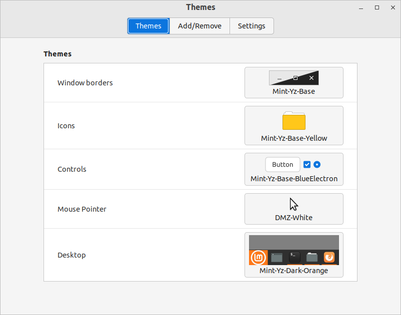

# Download and Install

First, check your system is not too old for this theme to work properly. This theme works well on Linux Mint 19, Linux Mint 20, and newer versions. (GTK+ 3.22 or newer) **Entirely tested** and re-tested on LinuxMint Cinnamon 20.3, and quickly tested on Mint Mate 20.3 and Mint Xfce 20.3.

1. Go to the **https://github.com/SebastJava/mint-yz-theme/releases/latest**
1. Click on the **mint-yz-theme_X.x.x.zip** to download or open.
1. Extract this zip.
1. Open your terminal and do this:  

```
# REMOVE ALL PREVIOUS VERSIONS (because different names were used...)
sudo rm -rf /usr/share/themes/Mint-Yz-*
# INSTALL
cd ~/Downloads
sudo cp -rf themes/* /usr/share/themes
```

Select your new themes in **Menu > Preferences > Themes or Appearance**.

## Remove (optional)

If you changed your mind and want to remove this group of themes, there are many ways to do so. But first of all, make sure you are not using these Mint-Yz themes anymore. Open Menu > Preferences > Themes or Appearance, and select something else, such as Mint-Y or Mint-X, for your "Controls," "Desktop," and "Window borders."

Next, type this in your terminal:  

```
sudo rm -rf /usr/share/themes/Mint-Yz-*
```

### Remove old Debian packages (if any)

1. First method : You can open your terminal and type:  
`apt remove mint-yz-theme`  
1. Second method : Or you can also open your Synaptic Package Manager, search (Ctrl+F) for `mint-yz-theme`, mark for removal, and apply.