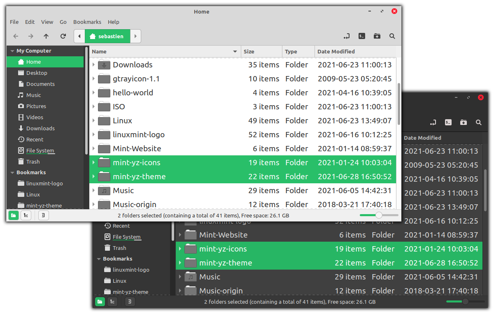
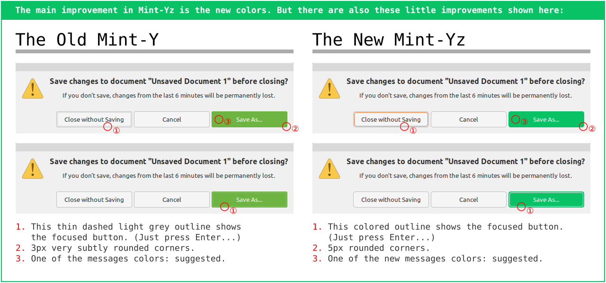

# Mint-Yz: The New Colors of a New Era (GTK theme)

**WORK IN PROGRESS: major overhaul**
The default branch got moved from newflat to master. And this master branch is currently being rebuild. So, it may look like there isn't much difference between the official Mint-Y and this redesigned and re-engineered Mint-Yz, because many Mint-Yz improvements are currently waiting to be merged from different branches. They are currently being tested before merging.

**Coming up**
The new Mint-Yz, version 3.0, should be ready sometime before the end of this winter. It with get all the upddates from the new Mint-Y, plus some improvements, and one undo: I want colored active buttons ! It is also getting a more organized method under the hood. You can still easily install the latest stable version while waiting... Please stay tuned !

Don't miss the **Mint-Yz-icons** with the same color scheme: https://github.com/SebastJava/mint-yz-icons

**The interface of all the software and the entire desktop is now rejuvenated, modernized. This is a fork from the reliable Mint-Y theme. It is the standard Linux Mint GTK theme now in a new edition with more energized and readable colors.**

That’s 11 different colors in 3 different variants: light, darker and darkest. This makes 33 different themes, all included in one Debian package. And all of this is done on a solid foundation of improved shell and Python programs. It is also renamed **Mint-Yz** and is a separate Debian package. This means you can install it in addition to the standard **Mint-Y,** compare, experiment, and change your mind at any time. Your good old Mint-Y will not be removed or changed. And all of this is made very easy, see the installation instructions below.

### Installation
First, check your system is not too old for this theme to work properly. This theme works well on Linux Mint 19, Linux Mint 20, and newer versions. (GTK+ 3.22 or newer)

1. Go to the [Releases](https://github.com/SebastJava/mint-yz-theme/releases) page. Select the latest.
1. Click on **Assets** to see the files if needed. (under the short presentation)
1. Download the **.deb** (Debian package) file.
1. Open it and click the **[Install Package]** button.
1. Select your new themes in **Menu > Preferences > Themes**

### These new colors convey good vibrations
I was seriously not satisfied with the old Mint-Y color palette. Those old colors are heavily subdued. I needed some vibrant colors to keep me motivated and focused. And i feel i am not the only one who wants better colors. So, i created this Mint-Yz.

But some people are saying these accent colors should be subdued. There are 2 reasons for this. First, eyes can get tired when overstimulated. Second, backgrounds made of bright saturated colors can be distracting. But please take this second argument with a pinch of salt: there is a difference between a page background and the background color for a focused element.

So, we need well balanced colors. Alive, but not aggressive. This means the saturation levels should be lowered. But i find this can vary greatly depending on the hue. And this combines with the lightness levels. I find that some little variations on the lightness levels can make big differences.

### A new approach to please everyone

There are 16.7 million color possibilities. We can't make them all. We want to offer 11 or 12 of them. With the dark and darker variants, that makes 33 or 36.

This new approach here is to offer a smaller range of colors, focusing on the most popular, but with much more variations. Something for each one of us. So, there are some heavily subdued colors for the nostalgic people. And there are also some vibrant colors to bring some happiness into those rainy days. But most of this new Mint-Yz color palette is made of well-balanced colors for a flat, modern user interface.

This translates into having some dull colors taken from the old Mint-Y. Those old ones are renamed with the "Classic" suffix, so, you know what you get. On the opposite, there are a few others that are coming from the previous versions of this Mint-Yz. These are renamed with the "Shine" suffix so, they are also clearly identified. And then there are all the others, and that is the majority of this new Mint-Yz. All these colors that are not part of the "Classic" or "Shine" groups are coming from https://flatuicolors.com/. These are well balanced colors and they should suit most people.

The https://flatuicolors.com/ offers a color palette created by a group of designers. These colors have been copied more than 25 million times from more than 150 countries around the world. The colors whose name ends with a "-2" have been slightly modified: it is a color located between the light version and the dark version of the same color on the same palette.

The few ColorShine colors come from the Mint-Yz-theme created by SebastJava. It's a fork of the Mint-Y theme that has been downloaded a few thousand times from https://www.pling.com/p/1408266/ without having done any advertisement. And that is without counting the downloads made directly on GitHub. This Mint-Yz theme received many highly positive comments.

### Other design improvements
Version 2.0 and up comes with other design improvements:

  * Buttons and entries rounded corners are a bit more rounded, 3px->5px. I never liked this 3px border-radius. This makes button’s rounded corners so subtle, it just looks like a rectangle with one missing pixel on each corner. Now this 3px->5px is not a radical change, you still get approximately the same flat design, but the corners on interactive elements are now just a bit more rounded.
  * Focused button outline = selected_bg_color, to see what Enter key does. Example: When you close an unsaved document, you get a dialog asking whether you want to Close without Saving, or Cancel, or Save. One of those buttons is already focused, so you can just press Enter key to make that choice, or press Tab to move the focus to another button, and then press Enter. But before it was hard to routinely press the Enter key without having some doubts, because the focus was very subtly indicated with a thin dashed grey line. This line is now solid and colored, so you know what you are doing when you press that Enter key !
  * No more dashed outlines ! The focused buttons are now more visible, but there are no more dashed outlines on other focused elements. Because i found annoying to see an outline in Nemo in some weird cases like when deleting a directory and then seeing a useless dashed outline on the other directory next to it for no reason, or when moving through selected directories using the arrow keys and then seeing both the selected background color and the dashed line on top of it.
  * Messages colors are updated. There are various preset colors for various messages. There is the links colors, and that green color on that "Save" button, or that red color on the logout button, etc. They all got updated.
  * Fixed bug on window borders. Before, in Cinnamon, when changing the GTK theme to another color, the window close buttons were not changing accordingly. Now these window borders are just selected separately, letting you choose to have a red close button with a green GTK theme, for example.  

------

### Other branches

There are many branches here. You can find a short description of each branch on [ALL-BRANCHES-short-description](ALL-BRANCHES-short-description.md)

------
### Credits
This theme is based on the Mint-Y theme, which is based on the Arc theme:

  * [https://github.com/linuxmint/mint-themes](https://github.com/linuxmint/mint-themes)
  * [https://github.com/horst3180/arc-theme](https://github.com/horst3180/arc-theme)
