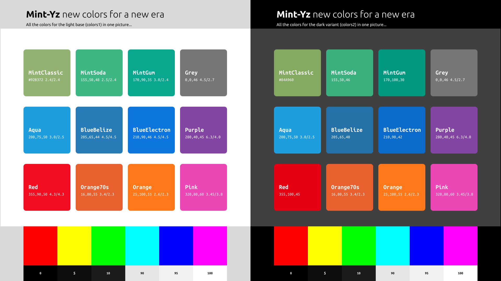

**Mint-Yz GTK themes:**

# Colors, Contrasts, and Design

Don't miss the Mint-Yz-icons with the same color scheme:  
(WIP — Mint-Yz-icons are not ready yet !)

**This is a new pack of various colour themes. 9 different colors, in both light and dark variants. That makes 18 new GTK themes. This will change the look of your entire LinuxMint system. These 18 colour variations are all packed into one Debian package. One download, one double-click, and then you can choose some new, fresh colors for your entire system.**

This Mint-Yz is a fork from the standard, reliable Mint-Y theme. It is renamed "Mint-Yz" and is a separate Debian package. Your good old Mint-Y will not be removed or changed. You can always switch back and forth from these Mint-Y and Mint-Yz colors and variants.

There is a lot of work into this new Mint-Yz. Over 200 commits. Build onto the latest stable Mint-Y, version 1.9.8. A lot of work got into creating, modifying, and testing those colors over and over again. But that's not only some new, nice colors here. There is much more than that here. There are also many subtle contrasts improvements. Making things more readable, and clearer. And then, there are also some subtle design improvements on top of all this. But not too much. You already like your Mint-Y theme, so this is just a bit different: this little "z" added to "Mint-Y", renaming it "Mint-Yz".

## Download and Install

First, check your system is not too old for this theme to work properly. This theme works well on Linux Mint 19, Linux Mint 20, and newer versions. (GTK+ 3.22 or newer) **Entirely tested** and re-tested on LinuxMint Cinnamon 20.3, and quickly tested on Mint Mate 20.3 and Mint Xfce 20.3.

1. Go to the [Releases](https://github.com/SebastJava/mint-yz-theme/releases) page. Select the latest. Click on the **mint-yz-theme_x.x_all.deb** Debian package to download or open.
1. Open it and click the **[Install Package]** button.
1. Select your new themes in **Menu > Preferences > Themes**.

# Colors

**Colors according to everyone's needs.**  
**Subdued, flat or shining colors.**  
**Sufficiently contrasted colors.**  

# Contrasts

| Variant | Category                        | Mint-Y        | Mint-Yz       |
| ------- | ------------------------------- | ------------- | ------------- |
| all     | buttons and entries backgrounds | no contrast   | subtle contrast |
| base    | hovering on buttons             | lighten (too subtle!) | darken 5% (better) |
| dark    | base color vs background color  | almost no difference | 2X difference | 
| dark    | check and radio buttons        | almost invisible when empty | subtle outline |
| dark    | check and radio buttons        | dark foreground | white foreground (\#F0F0F0) |
| all     | terminal background color      | Dark grey (\#3F3F3F) | 6% darker (\#303030) |

## Contrasts on dark themes : Mint-Y-Dark-Blue vs Mint-Yz-Dark-BlueElectron

## Contrasts on light themes : Mint-Y-Blue vs Mint-Yz-Base-BlueElectron

# Design

* Square window corners everywhere. I like round corners, but not when the top ones are round while the bottom ones are square. Additionally, on the official Mint-Y, the design keeps changing all the time. You get round top corners when the window is in the middle of the screen, and they turn square when you push tile. I don't like that. More over, there is a small rendering bug with Metacity round corners. All these problems are simply avoided by making all window corners square. Everywhere.
* No backgrounds on window close buttons. Round red background on hovering. That's nicer, and more logical. Before, with the default Mint-Y color, the close button was... green !? And we are also avoiding an old bug in the theme chooser !
* Subtle rounded corners on buttons and entries (3px -> 5px).
* Solid and coloured outlines on focused buttons and entries: more visible and nicer.
* No dashed outlines on other elements. This was unneeded and ugly. (Same as Mint-X here.)
* Message colors are better. That's for things like that green save button in the Xed text editor, or this red Logout button.
* And there are some small bug fixes. Et cetera.

---

## Credits

This theme is based on the Mint-Y theme, which is based on the Arc theme:  

https://github.com/linuxmint/mint-themes  
https://github.com/horst3180/arc-theme  
